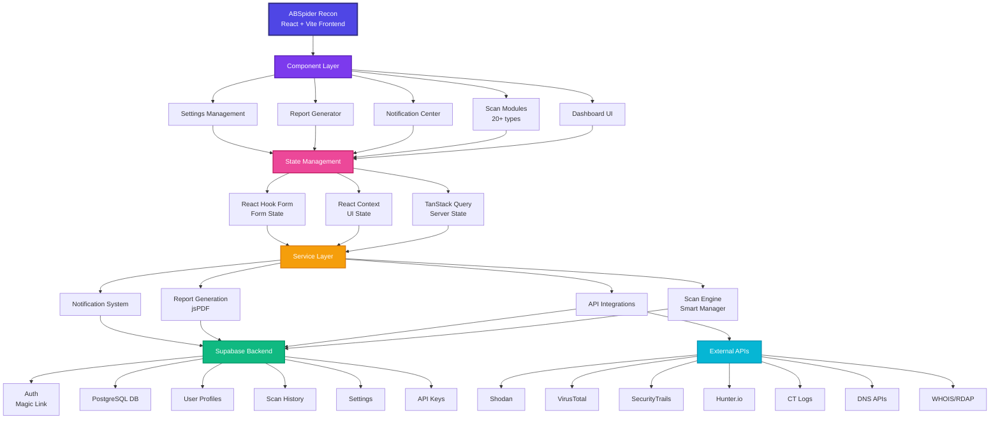

# 🕸️ ABSpider Recon: Web Security Made Easy!

<p align="center">
  <strong>Modern Web Security Intelligence Platform</strong>
</p>

<p align="center">
  <a href="https://github.com/zanesense/abspider-recon/releases">
    
  </a>
  <a href="https://github.com/zanesense/abspider-recon/blob/main/LICENSE">
    
  </a>
  <a href="https://github.com/zanesense/abspider-recon/stargazers">
    
  </a>
</p>

---

## 🎯 What is ABSpider?

ABSpider is a powerful browser-based reconnaissance dashboard built for security professionals, penetration testers, and bug bounty hunters. Combining **passive intelligence gathering** with **active vulnerability scanning**, it delivers actionable security insights through an intuitive modern interface.

**🌐 [Try Live Demo](https://abspider-recon.vercel.app)**

---

## 🎯 Why Choose ABSpider?

<table>
  <tr>
    <td align="center" width="16%">
      <b>🚀</b><br/>
      <b>Zero Backend</b><br/>
      <sub>Fully browser-based</sub>
    </td>
    <td align="center" width="16%">
      <b>🔒</b><br/>
      <b>Privacy-First</b><br/>
      <sub>Your data, your control</sub>
    </td>
    <td align="center" width="16%">
      <b>⚡</b><br/>
      <b>20+ Modules</b><br/>
      <sub>Comprehensive scanning</sub>
    </td>
    <td align="center" width="16%">
      <b>📊</b><br/>
      <b>Enterprise Reports</b><br/>
      <sub>Professional PDFs</sub>
    </td>
    <td align="center" width="16%">
      <b>🎨</b><br/>
      <b>Modern UX</b><br/>
      <sub>React + Tailwind</sub>
    </td>
    <td align="center" width="16%">
      <b>🔌</b><br/>
      <b>Extensible</b><br/>
      <sub>Optional API integrations</sub>
    </td>
  </tr>
</table>

---

## ✨ Key Features

### 🔍 Intelligence Gathering
- **Passive Reconnaissance:** WHOIS lookup, DNS enumeration, subdomain discovery via CT logs, GeoIP location
- **Active Scanning:** SQL injection, XSS detection, LFI scanning, port scanning, CORS testing
- **Technology Fingerprinting:** Identify frameworks, CMS, analytics, and server technologies
- **Security Analysis:** HTTP header scoring, SSL/TLS certificate validation, WAF detection

### 🛡️ Smart Scanning
- **AI-Powered Modes:** Conservative, adaptive, and aggressive scanning with intelligent payload management
- **Real-time Monitoring:** Target health tracking with automatic intensity adjustment
- **Stealth Detection:** Automatic WAF and rate-limiting detection

### 📊 Professional Reporting
- **Comprehensive PDF Reports:** Executive summaries, detailed findings, PoC snippets, and remediation guidance
- **Export Options:** JSON and PDF formats for easy integration with your workflow
- **Severity Scoring:** Clear vulnerability classification with confidence ratings

### 🔔 Stay Informed
- **Notification Center:** Real-time scan updates with smart categorization
- **Discord Integration:** Instant webhook notifications for critical alerts
- **Activity Dashboard:** Track scan history and performance metrics

### ⚙️ Advanced Configuration
- **Centralized Settings:** Manage API keys, proxies, and scan parameters from one place
- **Scan Templates:** Save and reuse configurations for repeated tasks
- **Scheduling:** Automate reconnaissance with daily, weekly, or monthly schedules
- **User Profiles:** Personalized preferences with role-based access

---

## 🚀 Quick Start

```bash
# Clone the repository
git clone https://github.com/zanesense/abspider-recon.git
cd abspider-recon

# Install dependencies
npm install

# Start development server
npm run dev
```

Access the dashboard at `http://localhost:5000`

---

## 🏗️ Project Architecture



### Tech Stack Breakdown

**Frontend Framework**
- React 18 with Vite for blazing-fast HMR
- TypeScript for type safety
- Tailwind CSS + shadcn/ui for modern UI

**State & Data Flow**
- TanStack Query for server state and caching
- React Context for global app state
- React Hook Form + Zod for form validation

**Backend & Storage**
- Supabase Auth (passwordless magic link)
- Supabase PostgreSQL for user data & scan results
- Row-level security for data isolation

**Scanning Engine**
- AI-powered payload management
- Adaptive rate limiting
- Multi-threaded execution
- Real-time health monitoring

**Reporting & Notifications**
- jsPDF + jspdf-autotable for PDF generation
- Discord webhook integration
- In-app notification center
- Sonner for toast notifications

---

## 📸 Interface Preview

<p align="center">
  
</p>

---

## 🧰 Reconnaissance Modules

| Module | Description | Type |
|--------|-------------|------|
| 🌐 Site Info | IP, server, CMS, robots.txt analysis | Passive |
| 🛡️ Headers | Security header scoring (HSTS, CSP, XFO) | Passive |
| 📜 WHOIS | Domain registration and ownership data | Passive |
| 📍 GeoIP | Server location identification | Passive |
| 📡 DNS | A, AAAA, CNAME, TXT, MX, NS records | Passive |
| 🔍 Subdomains | CT log enumeration and DNS discovery | Passive |
| 📈 SEO | Meta tags, headings, performance analysis | Passive |
| 🔌 Ports | Service detection with Shodan integration | Active |
| 💉 SQLi | SQL injection vulnerability testing | Active |
| ✍️ XSS | Reflected, DOM, and stored XSS detection | Active |
| 📁 LFI | Local file inclusion scanning | Active |
| ⚠️ CORS | Cross-origin misconfiguration testing | Active |
| 🦠 VirusTotal | Domain reputation and malware scanning | Active |
| 🔒 SSL/TLS | Certificate validation and analysis | Passive |

---

## 💼 Use Cases

<table>
  <tr>
    <td align="center" width="33%">
      <b>🎯</b><br/>
      <b>Bug Bounty Hunters</b><br/>
      <sub>Rapid reconnaissance and vulnerability discovery</sub>
    </td>
    <td align="center" width="33%">
      <b>🛡️</b><br/>
      <b>Penetration Testers</b><br/>
      <sub>Comprehensive security assessments with professional reporting</sub>
    </td>
    <td align="center" width="33%">
      <b>🔍</b><br/>
      <b>Security Researchers</b><br/>
      <sub>Deep-dive analysis of web application architecture</sub>
    </td>
  </tr>
  <tr>
    <td align="center" width="33%">
      <b>📋</b><br/>
      <b>Security Auditors</b><br/>
      <sub>Compliance testing and security posture evaluation</sub>
    </td>
    <td align="center" width="33%">
      <b>🚨</b><br/>
      <b>Red Team Operations</b><br/>
      <sub>Initial footprinting and attack surface mapping</sub>
    </td>
    <td align="center" width="33%">
      <b>👨‍💻</b><br/>
      <b>Developers</b><br/>
      <sub>Security testing during development lifecycle</sub>
    </td>
  </tr>
</table>

---

## 🔐 Security & Authentication

- **Supabase Authentication:** Passwordless magic link login
- **Role-Based Access:** Secure user management and permissions
- **Data Encryption:** Client-side storage with secure handling
- **API Key Management:** Optional integrations with Shodan, VirusTotal, SecurityTrails, and more

> ⚠️ **Security Notice:** API keys are stored client-side. Use test keys only—never production or sensitive credentials.

---

## ⚖️ Legal & Ethical Use

**⚠️ CRITICAL: Authorized Use Only**

- Only scan systems you **own** or have **explicit written permission** to test
- Unauthorized scanning is **illegal** in most jurisdictions
- You are **solely responsible** for compliance with applicable laws (CFAA, GDPR, etc.)
- Keep documentation of authorization for all scans
- Violations may result in criminal prosecution, fines, and civil liability

**This tool does not grant permission to scan any system.**

---

## 🛠️ Built With

<p align="center">
  
</p>

- **Frontend:** React + Vite + Tailwind CSS + TypeScript
- **UI Components:** shadcn/ui + Lucide Icons
- **Backend:** Supabase (Auth & Database)
- **Reports:** jsPDF + jspdf-autotable
- **State Management:** TanStack Query
- **Forms:** React Hook Form + Zod

---

## 🗺️ Roadmap

- [ ] Multi-target batch scanning
- [ ] Custom payload libraries
- [ ] Advanced WAF fingerprinting
- [ ] Automated vulnerability chaining
- [ ] Integration with popular security tools (Burp Suite, OWASP ZAP)
- [ ] Mobile app for iOS/Android
- [ ] Team collaboration features
- [ ] Backend API for enterprise deployments

---

## ❓ FAQ

**Q: Do I need API keys to use ABSpider?**  
A: No! ABSpider works out-of-the-box with passive modules. API keys are optional for enhanced features (Shodan, VirusTotal, etc.).

**Q: Is this legal to use?**  
A: Yes, but only on systems you own or have explicit written authorization to test. Unauthorized scanning is illegal.

**Q: Can I use this for commercial projects?**  
A: Yes! ABSpider is MIT licensed. You can use it for both personal and commercial purposes.

**Q: Does ABSpider store my scan data?**  
A: Scan results are securely stored in your Supabase database and associated with your account. Your data is private and accessible only to you.

**Q: How accurate are the vulnerability findings?**  
A: Results include confidence scores. Always manually verify findings before reporting vulnerabilities.

**Q: Can I contribute to the project?**  
A: Absolutely! Check our [contribution guidelines](https://github.com/zanesense/abspider-recon/blob/main/CONTRIBUTING.md).

---

## 📚 Documentation & Support

- 📖 [Full Documentation](https://github.com/zanesense/abspider-recon/wiki) *(Coming Soon)*
- 🐛 [Report Bugs](https://github.com/zanesense/abspider-recon/issues/new?template=bug_report.md)
- 💡 [Request Features](https://github.com/zanesense/abspider-recon/issues/new?template=feature_request.md)
- 💬 [Discussions](https://github.com/zanesense/abspider-recon/discussions)

---

## 🤝 Contributing

Contributions are welcome! Check out our [contribution guidelines](https://github.com/zanesense/abspider-recon/blob/main/CONTRIBUTING.md) to get started.

<a href="https://github.com/zanesense/abspider-recon/graphs/contributors">
  
</a>

---

## 📄 License

This project is licensed under the MIT License - see the [LICENSE](LICENSE) file for details.

---

<p align="center">
  <sub>Built with 💜 by <a href="https://github.com/zanesense">zanesense</a></sub>
  <br>
  <sub>Empowering security professionals worldwide 🚀</sub>
</p>