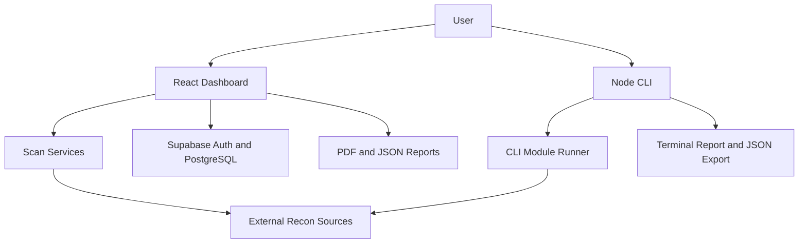

# ABSpider Recon

> A web reconnaissance dashboard and CLI for authorized passive intelligence gathering and active vulnerability checks.

<p align="left">
  <a href="https://abspider-recon.vercel.app"></a>
  <a href="./LICENSE"></a>
  <a href="https://github.com/zanesense/abspider-recon/actions"></a>
  
</p>

---

## Table of Contents

- [Overview](#overview)
- [Features](#features)
- [Reconnaissance Modules](#reconnaissance-modules)
- [How It Works](#how-it-works)
- [Repository Structure](#repository-structure)
- [Tech Stack](#tech-stack)
- [Requirements](#requirements)
- [Installation](#installation)
- [Configuration](#configuration)
- [Usage](#usage)
- [CLI Reference](#cli-reference)
- [Testing](#testing)
- [Deployment](#deployment)
- [Troubleshooting](#troubleshooting)
- [Security and Legal Use](#security-and-legal-use)
- [Roadmap](#roadmap)
- [Contributing](#contributing)
- [License](#license)

---

## Overview

ABSpider Recon helps security professionals, bug bounty hunters, developers, and auditors map a web target's public attack surface. The React dashboard stores authenticated scan history in Supabase, while the Node CLI runs directly from the terminal without a Supabase session. It combines passive lookups such as DNS, WHOIS/RDAP, GeoIP, SSL/TLS, and technology fingerprinting with active checks such as ports, CORS, SQL injection, XSS, LFI, WordPress indicators, broken links, and WAF/rate-limit probing.

Use it only on systems you own or have explicit written authorization to test.

---

## Features

- Runs passive reconnaissance from the browser dashboard or terminal CLI.
- Performs active checks with bounded payload counts, request delays, and thread controls.
- Provides conservative, adaptive, and aggressive scan styles for dashboard and CLI workflows.
- Streams CLI progress with per-module progress bars and immediate detailed results.
- Stores dashboard scan history, settings, preferences, and API keys in Supabase with row-level security.
- Generates JSON and PDF reports from dashboard scans.
- Integrates optional Shodan, VirusTotal, SecurityTrails, Hunter.io, and Discord webhook configuration.
- Supports passwordless Supabase authentication and per-user settings.
- Ships with Docker and Nginx configuration for static production hosting.

---

## Reconnaissance Modules

| Module | Dashboard | CLI | Type | Purpose |
| --- | --- | --- | --- | --- |
| Site Info | Yes | `siteInfo` | Passive | Fetches status, title, IP, server, and response metadata. |
| Headers | Yes | `headers` | Passive | Scores common security headers such as CSP, HSTS, XFO, and referrer policy. |
| WHOIS/RDAP | Yes | `whois` | Passive | Retrieves domain registration and nameserver information. |
| GeoIP | Yes | `geoip` | Passive | Resolves IP ownership and approximate location. |
| DNS | Yes | `dns` | Passive | Looks up A, AAAA, MX, NS, TXT, CNAME, and SOA records. |
| MX | Yes | `mx` | Passive | Lists mail exchange records. |
| Subnet | Yes | `subnet` | Passive | Calculates a basic IPv4 `/24` network summary when an IP is available. |
| Subdomains | Yes | `subdomains` | Passive | Checks a dashboard-style DNS wordlist, crt.sh certificate transparency logs, and optional SecurityTrails results. |
| Reverse IP | Yes | `reverseip` | Passive | Looks for domains associated with the same IP. |
| VirusTotal | Yes | `virustotal` | Passive | Reads VirusTotal domain reputation when an API key is configured. |
| SSL/TLS | Yes | `sslTls` | Passive | Inspects certificate subject, issuer, SANs, fingerprint, and expiry. |
| Tech Stack | Yes | `techStack` | Passive | Detects common frontend, CMS, analytics, CDN, and server indicators. |
| SEO | Yes | `seo` | Passive | Extracts title, meta description, canonical URL, headings, and link counts. |
| Ports | Yes | `ports` | Active | Checks web, common, or full TCP port profiles with bounded concurrency. |
| SQL Injection | Yes | `sqlinjection` | Active | Uses `src/payloads/sqli.json` and baseline-aware SQL error heuristics. |
| XSS | Yes | `xss` | Active | Uses `src/payloads/xss.json` and reports unencoded payload reflection. |
| LFI | Yes | `lfi` | Active | Uses `src/payloads/lfi.json` and reports known file-content markers. |
| WordPress | Yes | `wordpress` | Active | Checks WordPress paths such as `/wp-login.php`, `/wp-json/`, and `/xmlrpc.php`. |
| Broken Links | Yes | `brokenLinks` | Active | Checks discovered links and reports unreachable links. |
| CORS | Yes | `corsMisconfig` | Active | Tests wildcard or reflected arbitrary-origin CORS behavior. |
| DDoS/WAF | Yes | `ddosFirewall` | Active | Sends a bounded sequence of HEAD requests and records rate limiting indicators. |

---

## How It Works


```mermaid
flowchart TD
    U[User] --> D[React Dashboard]
    U --> C[Node CLI]
    D --> S[Scan Services]
    C --> M[CLI Module Runner]
    S --> X[External Recon Sources]
    M --> X
    D --> DB[Supabase Auth and PostgreSQL]
    D --> R[PDF and JSON Reports]
    C --> J[Terminal Report and JSON Export]
```

The dashboard and CLI share the same product model, but they run differently. The dashboard is a Vite React app backed by Supabase for authentication, persisted scans, settings, and user preferences. The CLI is a standalone Node script in `scripts/abspider-cli.mjs` that runs modules sequentially, prints each result as soon as it finishes, and can export the full result as JSON.

---

## Repository Structure

```text
abspider/
├── api/                    # Vercel edge proxy endpoint
├── docs/wiki/              # Supplemental user and configuration docs
├── public/                 # Favicons, manifest, robots.txt, static assets
├── scripts/                # CLI and utility scripts
├── src/components/         # Dashboard UI components
├── src/pages/              # React Router pages
├── src/payloads/           # SQLi, XSS, and LFI payload definitions
├── src/services/           # Scan modules, report generation, settings, APIs
├── supabase/migrations/    # Database, RLS, and storage migrations
├── Dockerfile              # Production static build served by Nginx
├── Dockerfile.dev          # Development container
└── vite.config.ts          # Vite config and path aliases
```

---

## Tech Stack

| Layer | Technology |
| --- | --- |
| Frontend | React 18, Vite 6, TypeScript 5 |
| Styling | Tailwind CSS, shadcn/ui, Radix UI, Lucide Icons |
| State and forms | TanStack Query, React Context, React Hook Form, Zod |
| Backend services | Supabase Auth, PostgreSQL, Storage, Row Level Security |
| Reports | jsPDF, jspdf-autotable, docx |
| CLI | Node.js ESM script with built-in `fetch`, DNS, TCP, and TLS APIs |
| Deployment | Vercel edge function support, Docker, Nginx |
| CI | GitHub Actions with lint, typecheck, build, and Vitest |

---

## Requirements

- Node.js 20 recommended. CI runs on Node 20.
- npm, using the committed `package-lock.json`.
- Supabase project for the dashboard auth and persisted scan history.
- Optional API keys for enhanced modules.
- Docker, only if you want containerized deployment.

The CLI can run without Supabase credentials for modules that do not require third-party API keys.

---

## Installation

```bash
git clone https://github.com/zanesense/abspider-recon.git
cd abspider-recon
npm install
cp .env.example .env
```

Edit `.env` with your Supabase project URL and anon key before running the dashboard.

```bash
npm run dev
```

The Vite dev server is configured for port `5000`. Open:

```text
http://localhost:5000
```

---

## Configuration

Configuration comes from `.env.example`. Vite exposes only variables prefixed with `VITE_` to the browser bundle.

| Variable | Required | Default | Description |
| --- | --- | --- | --- |
| `VITE_SUPABASE_URL` | Yes | none | Supabase project URL, for example `https://YOUR-PROJECT-REF.supabase.co`. |
| `VITE_SUPABASE_ANON_KEY` | Yes | none | Supabase anon publishable key. Use Row Level Security to protect data. |
| `VITE_SHODAN_API_KEY` | No | none | Enables Shodan-backed lookups where supported. |
| `VITE_VIRUSTOTAL_API_KEY` | No | none | Enables VirusTotal domain reputation checks in the dashboard. |
| `VITE_SECURITYTRAILS_API_KEY` | No | none | Enables SecurityTrails-backed DNS intelligence where supported. |
| `VITE_HUNTER_API_KEY` | No | none | Enables Hunter.io-backed email intelligence where supported. |
| `VITE_DISCORD_WEBHOOK_URL` | No | none | Sends scan notifications to a Discord webhook. Treat this as a secret. |

For CLI VirusTotal scans, set either `VIRUSTOTAL_API_KEY` or `VITE_VIRUSTOTAL_API_KEY` in your shell environment.

### Supabase setup

Apply the migrations in `supabase/migrations/` before using the dashboard end to end.

```bash
supabase link --project-ref <YOUR_PROJECT_REF>
supabase db push
```

If you do not use the Supabase CLI, run these files in the Supabase SQL Editor in order:

1. `supabase/migrations/0001_init_schema.sql`
2. `supabase/migrations/0002_rls_policies.sql`
3. `supabase/migrations/0003_storage_avatars.sql`

See [supabase/README.md](supabase/README.md) for verification steps.

---

## Usage

### Dashboard

```bash
npm run dev
```

Use the dashboard to:

1. Sign in with Supabase magic link authentication.
2. Configure optional API keys, proxy settings, webhooks, and scan preferences.
3. Start a scan from the New Scan page.
4. Watch progress and review module results.
5. Export reports as JSON or PDF.

### CLI

Install the published CLI:

```bash
npm install -g abspider
abspider example.com
```

The default CLI profile runs passive modules. It prints the ABSpider banner, shows a live progress bar for each module, prints detailed results immediately after that module finishes, and ends with a compact summary.

```bash
# Run passive reconnaissance
abspider example.com

# Run every passive and active CLI module
abspider https://example.com --all

# Run only active checks with conservative settings
abspider https://example.com --active --mode conservative

# Run selected modules and save full JSON
abspider example.com --modules whois,dns,sslTls,ports,cors --output scan.json

# Run a broader scan while keeping the common port profile
abspider https://example.com --all --mode aggressive --port-profile common

# Generate machine-readable output
abspider example.com --modules dns,sslTls --json --pretty
```

For local development from this repository, use:

```bash
npm run cli -- example.com
```

Operational notes:

- Press `Ctrl+C` to stop gracefully. The CLI aborts in-flight work, skips remaining modules, and preserves partial results and JSON output.
- The CLI runs in Node.js, so browser CORS restrictions do not apply to CLI requests.
- CDN and WAF protections such as Cloudflare are detected and reported when visible in headers, status codes, or challenge pages. The CLI does not evade access controls or bypass provider challenges.

---

## CLI Reference

```text
abspider <target> [options]
abspider-recon <target> [options]
```

| Option | Description |
| --- | --- |
| `--passive` | Run passive modules only. This is the default. |
| `--active` | Run active modules only. |
| `--all` | Run passive and active modules. |
| `--modules <list>` | Run a comma-separated module list or aliases. |
| `--mode <name>` | Scan style: `conservative`, `adaptive`, or `aggressive`. Default: `adaptive`. |
| `--ports <list>` | Comma-separated ports for the `ports` module. Overrides the mode/profile port set. |
| `--port-profile <name>` | Port set for the `ports` module: `web`, `common`, or `full`. The mode chooses a default profile. |
| `--threads <number>` | Max concurrent port and subdomain checks. The mode chooses the default. |
| `--timeout <ms>` | HTTP, socket, and module timeout value. Default: `10000`. |
| `--payloads <number>` | Max payloads per SQLi, XSS, and LFI check. Payloads are read from `src/payloads`. |
| `--ddos-requests <n>` | Bounded WAF/rate-limit probe request count. The mode chooses the default. |
| `--delay <ms>` | Delay between active payload requests. The mode chooses the default. |
| `--subdomain-limit <n>` | Max DNS wordlist entries to check before CT/API sources. |
| `--no-ct` | Disable crt.sh certificate transparency lookup. |
| `--json` | Print full JSON instead of terminal UI output. |
| `--pretty` | Pretty-print JSON output. |
| `--output <file>` | Write full JSON results to a file. |
| `--no-color` | Disable ANSI colors and gradients. |
| `--help` | Show CLI help. |
| `--version` | Show CLI version. |

---

## Testing

```bash
npm run lint
npm run typecheck
npm test
npm run build
npm run audit
```

The GitHub Actions workflow runs lint, typecheck, build, and tests on pushes and pull requests to `main`.

---

## Deployment

### Vercel

The repository includes `api/proxy.ts`, an Edge Runtime proxy endpoint intended for Vercel deployments.

1. Create a Vercel project from this repository.
2. Add the required `VITE_SUPABASE_URL` and `VITE_SUPABASE_ANON_KEY` environment variables.
3. Add optional `VITE_*` integration keys as needed.
4. Deploy with the default Vite build command.

### Docker production

The production Docker image builds the Vite app and serves `dist/` through Nginx on container port `8080`.

```bash
docker compose up --build app
```

Open:

```text
http://localhost:3000
```

### Docker development

```bash
docker compose --profile dev up --build dev
```

Open:

```text
http://localhost:5000
```

---

## Troubleshooting

| Problem | Fix |
| --- | --- |
| Dashboard cannot load scans | Confirm Supabase migrations have been applied and `.env` contains the correct URL and anon key. |
| Sign-in works but no rows are visible | Check that Row Level Security policies from `0002_rls_policies.sql` were applied. |
| VirusTotal module is skipped in the CLI | Set `VIRUSTOTAL_API_KEY` or `VITE_VIRUSTOTAL_API_KEY` in your shell. |
| CLI active modules are too noisy | Lower `--payloads`, increase `--delay`, or run selected modules only. |
| CLI scan is too slow | Use `--mode conservative`, lower `--threads`, choose `--port-profile web`, or disable CT lookup with `--no-ct`. |
| CLI reports Cloudflare or WAF challenge | Results may describe the edge challenge instead of the origin app. Use an authorized allowlist, staging host, or provider-approved testing path. |
| Browser scan hits CORS limitations | Use the CLI for server-side requests, or deploy/configure an authorized proxy for browser workflows. |
| Port checks fail with permission or network errors | Run from a network that allows outbound TCP checks and verify local firewall rules. |
| Docker production serves a blank page | Rebuild the image and confirm required environment values were provided at build time for the Vite bundle. |

More guides are available in [docs/wiki](docs/wiki).

---

## Security and Legal Use

ABSpider Recon is a security testing tool. It does not grant permission to scan any system.

- Scan only assets you own or have explicit written permission to test.
- Keep authorization records for professional assessments.
- Use conservative payload counts and delays against production systems.
- Treat webhook URLs and third-party API keys as secrets.
- Review [SECURITY.md](SECURITY.md) before reporting vulnerabilities in this project.

To report a security vulnerability in ABSpider Recon, use the [GitHub Security Advisory flow](https://github.com/zanesense/abspider-recon/security/advisories/new) or email `security@zanesense.dev`. Do not open a public issue for suspected vulnerabilities.

---

## Roadmap

- [ ] Multi-target batch scanning.
- [ ] Custom payload libraries.
- [ ] Advanced WAF fingerprinting.
- [ ] Report templates for common assessment types.
- [ ] Integrations with Burp Suite and OWASP ZAP.
- [ ] Team collaboration features.
- [ ] Backend API mode for enterprise deployments.

---

## Contributing

Contributions are welcome.

```bash
git checkout -b feature/short-description
npm install
npm run lint
npm run typecheck
npm test
npm run build
```

Open a pull request with:

- A short description of the change.
- Screenshots or terminal output for UI and CLI changes.
- Notes about any new environment variables or migrations.
- Test results for the commands above.

---

## License

ABSpider Recon is licensed under the [MIT License](LICENSE).
