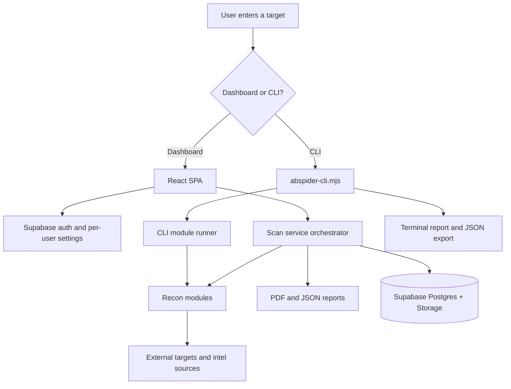
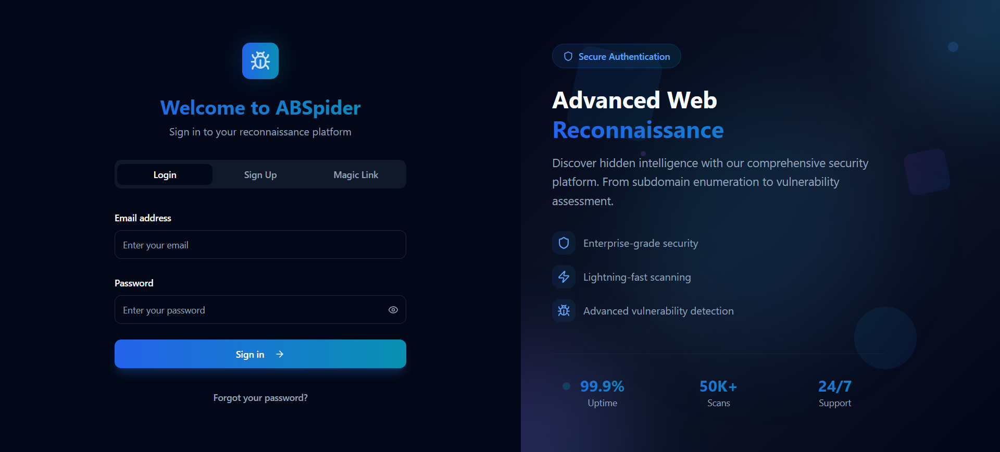
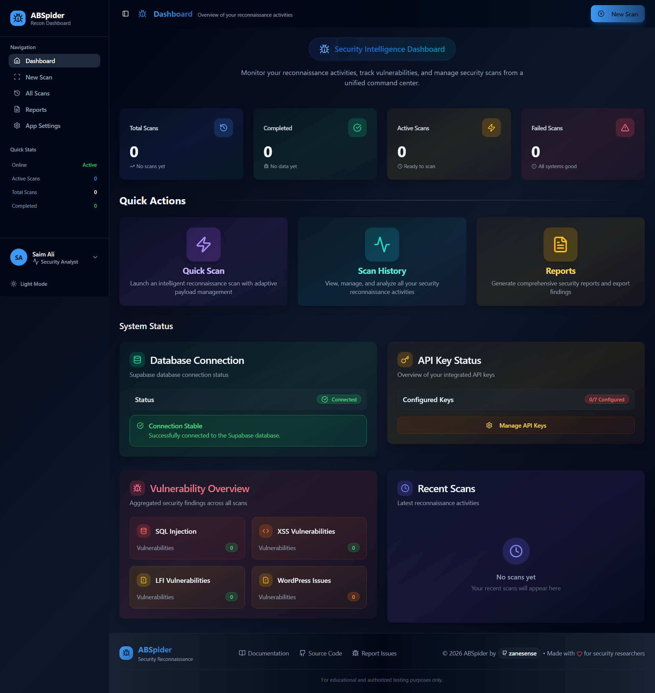
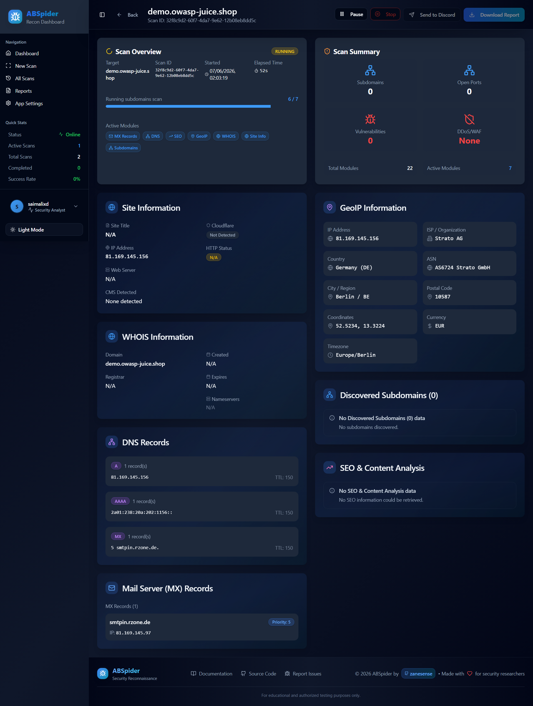
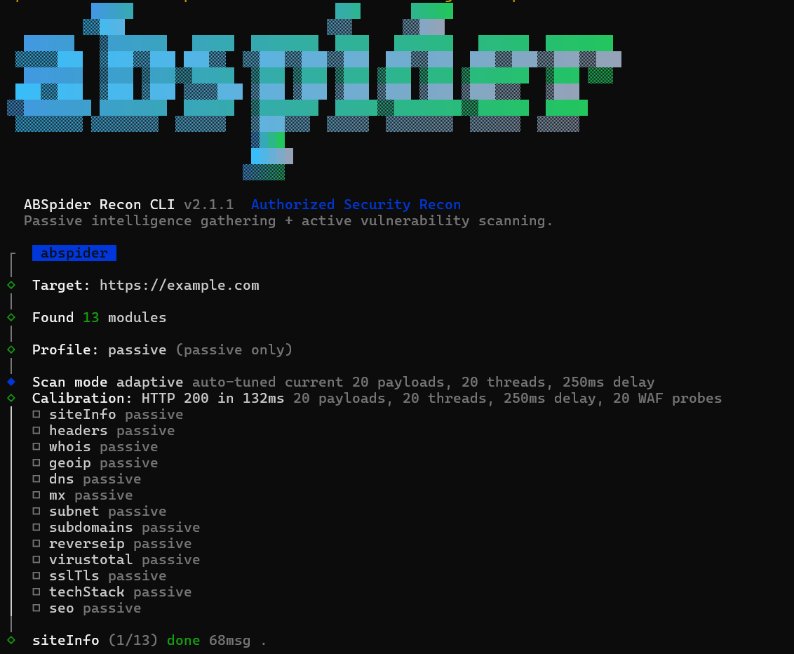
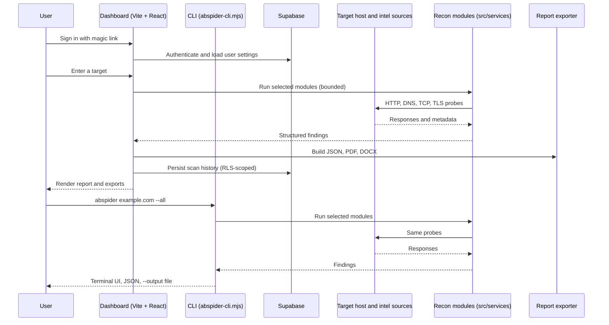

# ABSpider Recon - Web Security Made Easy!

> A web reconnaissance dashboard and CLI for **authorized** passive intelligence gathering and active vulnerability checks — built for bug bounty hunters, security engineers, and auditors.

<p align="center">
  <a href="https://deepwiki.com/zanesense/abspider-recon"></a>
  
  

</p>

> 🚀 **[Try the live demo →](https://abspider.zanesense.dev)** — point it at a target you own and explore the recon workflow.

---

## 🧭 Quick Links

| Link | Description |
| --- | --- |
| 🌐 [Live demo](https://abspider.zanesense.dev) | Hosted dashboard at `abspider.zanesense.dev` |
| 📦 [npm package](https://www.npmjs.com/package/abspider) | Run the local CLI with `npx abspider example.com` |
| 📦 [Repository](https://github.com/zanesense/abspider-recon) | Source code, issues, and releases |
| 🐛 [Issue tracker](https://github.com/zanesense/abspider-recon/issues) | Report bugs and request modules |
| 🔀 [Pull requests](https://github.com/zanesense/abspider-recon/pulls) | Open a PR to contribute a payload or module |
| ⭐ [Stargazers](https://github.com/zanesense/abspider-recon/stargazers) | See who starred the project |
| 📄 [License](https://github.com/zanesense/abspider-recon/blob/main/LICENSE) | MIT terms |
| 📝 [Changelog](CHANGELOG.md) | Release history and notable implementation changes |
| 🛡️ [Security policy](https://github.com/zanesense/abspider-recon/blob/main/SECURITY.md) | Reporting vulnerabilities in ABSpider itself |
| 📚 [Wiki](docs/wiki) | Extended configuration, legal, and user guides |
| 🤖 [DeepWiki](https://deepwiki.com/zanesense/abspider-recon) | AI-generated repository documentation |

---

## 🗂️ Table of Contents

- [📖 Overview](#-overview)
- [✨ Features](#-features)
- [🛰️ Reconnaissance Modules](#-reconnaissance-modules)
- [🧠 How It Works](#-how-it-works)
- [📂 Repository Structure](#-repository-structure)
- [🧰 Tech Stack](#-tech-stack)
- [📋 Requirements](#-requirements)
- [🛠️ Installation](#-installation)
  - [Dashboard (web app)](#dashboard-web-app)
  - [CLI (npm package)](#cli-npm-package)
  - [Production build](#production-build)
- [⚙️ Configuration](#-configuration)
- [🛠️ Usage](#-usage)
  - [Dashboard](#dashboard)
  - [Local CLI](#local-cli)
  - [Programmatic API](#programmatic-api)
  - [Screenshots](#screenshots)
- [🧪 Testing](#-testing)
- [🔄 Project Flow](#-project-flow)
- [🔌 API Reference](#-api-reference)
  - [`GET /api/proxy`](#get-apiproxy)
  - [CLI JSON output](#cli-json-output)
- [💡 Examples](#-examples)
  - [Safe targets to try](#safe-targets-to-try)
  - [What a finding looks like](#what-a-finding-looks-like)
- [🚀 Deployment](#-deployment)
  - [Vercel static hosting](#vercel-static-hosting)
  - [Docker production](#docker-production)
  - [Docker development](#docker-development)
  - [Static host](#static-host)
- [🗺️ Roadmap](#-roadmap)
- [🤝 Contributing](#-contributing)
- [📝 Changelog](CHANGELOG.md)
- [🛟 Troubleshooting](#-troubleshooting)
- [🔐 Security and Legal Use](#-security-and-legal-use)
- [📄 License](#-license)
- [❤️ Acknowledgements](#-acknowledgements)
- [👥 Contributors](#-contributors)

---

## 📖 Overview

Most public web attacks start with **the same recon**: a DNS lookup, a certificate transparency query, a port scan, a header review, and a handful of well-known payload checks. ABSpider Recon is a focused, opinionated recon toolkit that bundles those workflows behind one dashboard and one terminal command. It is built for:

- 🐛 **Bug bounty hunters** who need a fast first pass against an in-scope target.
- 🛡️ **Security engineers** running pre-audit reconnaissance on assets they own.
- 🎓 **Students and educators** teaching the structure of a modern web recon workflow.
- 🧰 **Tooling authors** who want a clean JSON recon payload to feed into other tools.

> ⚠️ **Authorization is non-negotiable.** ABSpider Recon is a security testing tool. It does not grant permission to scan any system. Use it only on assets you own or have explicit written authorization to test. See [🔐 Security and Legal Use](#-security-and-legal-use).

It is built on a clear split:

- 🖥️ **Dashboard** — a Vite + React + Supabase app with email/password and magic-link auth, remembered sessions, persisted scan history, JSON/PDF report export, and per-user settings.
- 💻 **CLI** — a Node.js ESM script that runs the same recon modules from the terminal, with bounded payload counts, request delays, and thread controls. No Supabase session required.

Both surfaces share the same scanner engine. Pick whichever fits the engagement.

---

## ✨ Features

- 🛰️ **35 recon modules** spanning passive intelligence, header analysis, fingerprinting, infrastructure analysis, and bounded active checks.
- 🧠 **Three scan styles** — `conservative`, `adaptive` (default), and `aggressive` — for both dashboard and CLI workflows.
- 🛡️ **Bounded by design** — every active module has explicit payload counts, request delays, and concurrency limits. Nothing fires blindly.
- 💻 **Local CLI** — run the full scanner from your terminal with `npx abspider <target>`, or `npm run cli -- <target>` for local development.
- 🔐 **Flexible auth** — Supabase email/password and magic-link sign-in protect dashboard history; "Remember me" keeps sessions across browser restarts, while unchecked sessions are cleared after the browser session ends.
- 📊 **Per-user scan history** — Supabase PostgreSQL with row-level security, plus per-user API keys, preferences, and Discord webhook config.
- 📥 **JSON + PDF reports** — export a dashboard scan as JSON, a styled PDF (`jsPDF` + `jspdf-autotable`), or DOCX.
- 🧩 **Optional third-party intel** — Shodan, VirusTotal, SecurityTrails, BuiltWith, OpenCage, Hunter.io, Clearbit, and Discord webhooks plug in when you bring your own keys.
- 🔀 **Smart proxy routing** — CORS-friendly third-party APIs use direct browser requests, while target-site probes can fall back to the Vercel `/api/proxy` function or the FastAPI proxy in Docker/self-hosted deployments.
- 📚 **Bundled documentation site** — the static docs in `docs/` are served at `/docs/` in development and copied into `dist/docs/` during production builds.
- 🐳 **Container-ready** — production `Dockerfile` (Nginx), `Dockerfile.backend` (FastAPI proxy), and dev `Dockerfile.dev` (Vite) ship in the repo; `docker compose` orchestrates the full stack.
- ⏱️ **Graceful shutdown** — `Ctrl+C` aborts the CLI cleanly, preserves partial results, and finishes writing any `--output` JSON.
- 🧪 **Strict pipeline** — ESLint 9, strict TypeScript, Vitest, and `npm audit` (production only) run in CI on every push and PR.

---

## 🛰️ Reconnaissance Modules

| Module | Dashboard | CLI flag | Type | Purpose |
| --- | :-: | --- | --- | --- |
| Site Info | ✅ | `siteInfo` | Passive | Status, title, server, IP, and response metadata. |
| Headers | ✅ | `headers` | Passive | Scores common security headers (CSP, HSTS, XFO, Referrer-Policy, Permissions-Policy). |
| WHOIS / RDAP | ✅ | `whois` | Passive | Domain registration, registrar, nameservers, and creation/expiry dates. |
| GeoIP | ✅ | `geoip` | Passive | IP ownership and approximate geolocation. |
| DNS | ✅ | `dns` | Passive | A, AAAA, MX, NS, TXT, CNAME, and SOA records. |
| MX | ✅ | `mx` | Passive | Mail exchange records and preference order. |
| Subnet | ✅ | `subnet` | Passive | Basic IPv4 `/24` network summary when an IP is available. |
| Subdomains | ✅ | `subdomains` | Passive | DNS wordlist, crt.sh certificate transparency, and optional SecurityTrails results. |
| Reverse IP | ✅ | `reverseip` | Passive | Other domains on the same IP. |
| VirusTotal | ✅ | `virustotal` | Passive | Domain reputation when an API key is configured. |
| SSL / TLS | ✅ | `sslTls` | Passive | Certificate subject, issuer, SANs, fingerprint, and expiry. |
| Tech Stack | ✅ | `techStack` | Passive | Frontend, CMS, analytics, CDN, and server fingerprinting. |
| SEO | ✅ | `seo` | Passive | Title, meta description, canonical URL, headings, and link counts. |
| Ports | ✅ | `ports` | Active | Web, common, or full TCP port profiles with bounded concurrency. |
| SQL Injection | ✅ | `sqlinjection` | Active | Loads `src/payloads/sqli.json` and uses baseline-aware SQL error heuristics. |
| XSS | ✅ | `xss` | Active | Loads `src/payloads/xss.json` and reports unencoded payload reflection. |
| LFI | ✅ | `lfi` | Active | Loads `src/payloads/lfi.json` and matches known file-content markers. |
| WordPress | ✅ | `wordpress` | Active | Checks common WordPress paths (`/wp-login.php`, `/wp-json/`, `/xmlrpc.php`). |
| Broken Links | ✅ | `brokenLinks` | Active | Walks discovered links and reports unreachable ones. |
| CORS | ✅ | `corsMisconfig` | Active | Tests wildcard or reflected arbitrary-origin CORS responses. |
| WAF Protection | ✅ | `ddosFirewall` | Active | Sends a bounded sequence of HEAD requests and records WAF/CDN and rate-limit signals. |
| CDN Detection | ✅ | `cdnDetection` | Passive | Identifies CDN providers via response headers and CNAME records. |
| Cloud Provider | ✅ | `cloudProvider` | Passive | Detects cloud hosting provider via headers and DNS. |
| Email Security | ✅ | `emailSecurity` | Passive | SPF/DKIM/DMARC record analysis and security scoring. |
| Cookie Audit | ✅ | `cookieAudit` | Passive | Checks Secure, HttpOnly, SameSite flags on all cookies. |
| JS Analysis | ✅ | `jsInspection` | Passive | Extracts API endpoints, keys, and internal paths from JS bundles. |
| S3 Buckets | ✅ | `s3Bucket` | Active | Discovers open or leaky AWS S3 buckets for the domain. |
| Git Exposure | ✅ | `gitExposure` | Active | Detects exposed .git/config, .env, and backup files. |
| Email Harvesting | ✅ | `emailHarvesting` | Passive | Extracts email addresses from pages, mailto links, and robots.txt. |
| Sitemap/Robots | ✅ | `robotsSitemap` | Passive | Parses robots.txt disallowed paths and sitemap.xml structure. |
| Open Redirect | ✅ | `openRedirect` | Active | Finds redirect parameters vulnerable to SSRF and phishing. |
| CVE Scanner | ✅ | `cveScanner` | Passive | Cross-references detected tech stack versions against known CVEs. |
| GraphQL | ✅ | `graphQL` | Active | Checks for exposed GraphQL schemas on common endpoints. |
| Rate Limiting | ✅ | `rateLimit` | Active | Verifies if the target rate-limits rapid requests. |
| CSRF Detection | ✅ | `csrfDetection` | Passive | Scans forms for missing CSRF tokens. |

> 🔎 **Dashboard-only convenience modules** (settings, preferences, key vault) live under `src/services/` and are not part of the recon flow.

---

## 🧠 How It Works

ABSpider Recon is a Vite SPA backed by Supabase. The browser is the only client; the scanner modules run inside the browser for the dashboard and inside Node.js for the CLI. Both surfaces share the same module contracts.


```mermaid
flowchart TD
    A[User enters a target] --> B{Dashboard or CLI?}
    B -- Dashboard --> D[React SPA]
    B -- CLI --> C[abspider-cli.mjs]
    D --> E[Supabase auth and per-user settings]
    D --> F[Scan service orchestrator]
    C --> M[CLI module runner]
    F --> X[Recon modules]
    M --> X
    X --> Y[External targets and intel sources]
    F --> R[PDF and JSON reports]
    C --> J[Terminal report and JSON export]
    F --> DB[(Supabase Postgres + Storage)]
```

Key design choices:

- **Browser-first dashboard** — the dashboard does the work in the browser using a small `requestManager` and per-module backoff. The Vercel `/api/proxy` function is available in hosted deployments, and the FastAPI proxy is available when you run the backend or Docker stack.
- **Direct API calls when supported** — CORS-enabled providers such as Google DNS, crt.sh, RDAP, Shodan, VirusTotal, SecurityTrails, BuiltWith, OpenCage, Hunter.io, Clearbit, ipapi, and ip-api bypass `/api/proxy` so JSON responses are not replaced by proxy HTML or gateway errors.
- **Bounded active modules** — every active module reads payloads from `src/payloads/*.json` and respects the per-mode cap, delay, and concurrency settings.
- **Deterministic payloads** — the JSON payload files are version-controlled. You can audit, extend, or replace them without touching the runner.
- **No telemetry** — ABSpider Recon does not phone home. API keys never leave your browser session, and scan results are scoped to your Supabase row-level security policies.

---

## 📂 Repository Structure

```text
abspider-recon/
├── backend/
│   ├── main.py                       # FastAPI CORS proxy at /api/proxy
│   └── requirements.txt              # Python backend dependencies
│
├── api/
│   └── proxy.ts                      # Vercel serverless proxy at /api/proxy
│
├── docs/
│   ├── index.html                    # Static documentation site served at /docs/
│   └── wiki/                         # Supplemental user, configuration, legal guides
│
├── packages/
│   └── cli/                          # Published npm package `abspider`
│       ├── package.json              # bin: abspider, abspider-recon
│       ├── README.md                 # npm-facing usage docs
│       └── scripts/abspider-cli.mjs  # CLI entry point bundled into the npm tarball
│
├── public/                           # Favicons, manifest, screenshots, static assets
│
├── src/
│   ├── App.tsx                       # Router, providers, app shell
│   ├── main.tsx                      # Vite entry point
│   ├── SupabaseClient.ts             # Typed Supabase client
│   ├── components/                   # Dashboard UI components and module result views
│   │   ├── landing/                  # Landing-page sections
│   │   └── ui/                       # shadcn-style primitives
│   ├── contexts/                     # Theme + notification React contexts
│   ├── hooks/                        # Custom React hooks
│   ├── images/                       # Brand assets
│   ├── lib/                          # Shared utilities
│   ├── pages/                        # React Router pages
│   ├── payloads/                     # SQLi, XSS, and LFI payload JSON files
│   ├── services/                     # 35 recon modules, proxy client, reports, settings, scan orchestrator
│   ├── shims/                        # Browser shims
│   └── utils/                        # Report/content helpers
│
├── supabase/
│   └── migrations/                   # 0001 init schema, 0002 RLS, 0003 storage
│
├── .env.example                      # Template for VITE_* env vars
├── components.json                   # shadcn/ui config
├── docker-compose.yml                # backend, app, and dev services
├── Dockerfile                        # Production Vite build served by Nginx on :8080
├── Dockerfile.backend                # FastAPI proxy image on :8000
├── Dockerfile.dev                    # Vite dev server on :5000
├── CHANGELOG.md                      # Release history and notable changes
├── eslint.config.js                  # ESLint 9 + typescript-eslint
├── LICENSE                           # MIT
├── nginx.conf                        # Nginx static + /api proxy config
├── package.json                      # Scripts and app dependencies
├── postcss.config.js                 # Tailwind + Autoprefixer
├── README.md                         # You are here
├── SECURITY.md                       # Vulnerability reporting policy
├── tailwind.config.js                # Tailwind v3 design tokens
├── tsconfig.app.json                 # Strict TS config for the app
├── tsconfig.json                     # Root TS config
├── tsconfig.node.json                # TS config for Node/Vite files
└── vite.config.ts                    # Vite config, dev proxy, and path aliases
```

---

## 🧰 Tech Stack

| Layer | Choice |
| --- | --- |
| Framework | [Vite 6](https://vitejs.dev/) + [React 18](https://react.dev/) + [React Router 7](https://reactrouter.com/) |
| Language | [TypeScript 6](https://www.typescriptlang.org/) (strict mode) |
| Styling | [Tailwind CSS 3](https://tailwindcss.com/) + [shadcn/ui](https://ui.shadcn.com/) (locally authored) + [Radix UI](https://www.radix-ui.com/) + [Lucide](https://lucide.dev/) |
| State and forms | [TanStack Query 5](https://tanstack.com/query), React Context, [React Hook Form 7](https://react-hook-form.com/), [Zod 3](https://zod.dev/) |
| Auth and persistence | [Supabase](https://supabase.com/) Auth, PostgreSQL, Storage, Row Level Security |
| Reports | [jsPDF](https://github.com/parallax/jsPDF), [jspdf-autotable](https://github.com/simonbengtsson/jsPDF-AutoTable), [docx](https://docx.js.org/) |
| CLI | Node.js ≥ 20 ESM script using built-in `fetch`, `dns`, `net`, and `tls` |
| Deployment | [Vercel](https://vercel.com/) static SPA, [Docker](https://www.docker.com/) + Nginx + FastAPI, self-hosted static |
| Linting | [ESLint 9](https://eslint.org/) + `typescript-eslint` |
| Type checking | `tsc -b --noEmit` |
| Testing | [Vitest 4](https://vitest.dev/) |
| CI | GitHub Actions: lint, typecheck, build, test, and `npm audit --omit=dev` |

---

## ✅ Requirements

- **Node.js** ≥ 20 (CI runs on Node 20; the published CLI requires Node ≥ 20).
- **npm** ≥ 9 with the committed `package-lock.json` (a `bun.lock` is also present for Bun users).
- **Supabase** project for the dashboard auth, persisted scan history, and per-user settings.
- **Optional API keys** for enhanced modules (Shodan, VirusTotal, SecurityTrails, BuiltWith, OpenCage, Hunter.io, Clearbit, Discord).
- **Docker**, only if you want containerized deployment.

> The CLI can run **without** Supabase or any third-party keys. Core passive modules (DNS, WHOIS, headers, SSL, ports) work out of the box on a fresh clone.

---

## 🛠️ Installation

### Dashboard (web app)

```bash
# 1. Clone the repository
git clone https://github.com/zanesense/abspider-recon.git
cd abspider-recon

# 2. Install dependencies
npm install

# 3. Copy and populate environment variables
cp .env.example .env
# Edit .env with your Supabase project URL and anon key (see Configuration below)

# 4. Apply Supabase migrations
supabase link --project-ref <YOUR_PROJECT_REF>
supabase db push

# 5. Start the dev server
npm run dev
```

The Vite dev server listens on port `5000` by default:

```text
http://localhost:5000
```

For CORS-limited dashboard scans, run the FastAPI proxy on port `8000` in another terminal. Vite proxies `/api/*` to that backend during development:

```bash
cd backend
python -m venv .venv
. .venv/bin/activate  # Windows PowerShell: .venv\Scripts\Activate.ps1
pip install -r requirements.txt
uvicorn main:app --reload --host 0.0.0.0 --port 8000
```

Docker users can run the backend instead:

```bash
docker compose up --build backend
```

### CLI (npm package)

The CLI is published as [`abspider`](https://www.npmjs.com/package/abspider) and ships its own bundled `abspider-cli.mjs` plus the payload JSON files. Install it once and run it anywhere:

```bash
# One-off scan
npx abspider example.com

# Or install globally
npm install -g abspider
abspider example.com
```

For local development from this repository (uses `packages/cli/scripts/abspider-cli.mjs`):

```bash
npm run cli -- example.com
```

### Production build

```bash
npm run build
```

`npm run build` runs the strict TypeScript project references (`tsc -b`) and then `vite build`, producing a static bundle in `dist/` and copying the documentation site into `dist/docs/`. Serve `dist/` from any static host, or use the production Docker image. Browser-side CORS fallback uses Vercel `api/proxy.ts` on Vercel and the FastAPI proxy in Docker/self-hosted deployments.

---

## ⚙️ Configuration

ABSpider Recon uses environment variables for the frontend and Supabase migrations for persistence. The optional FastAPI proxy does not require environment variables by default.

| Variable | Required | Default | Description |
| --- | :-: | --- | --- |
| `VITE_SUPABASE_URL` | ✅ | none | Supabase project URL, e.g. `https://YOUR-PROJECT-REF.supabase.co`. |
| `VITE_SUPABASE_ANON_KEY` | ✅ | none | Supabase anon publishable key. Protect your data with Row Level Security. |

> Vite only exposes variables prefixed with `VITE_` to the browser bundle. Do not put private API keys in Vite env vars unless you intentionally want them bundled into browser-accessible JavaScript.

Dashboard API keys and Discord webhook URLs are configured per user in **Settings** and stored in Supabase. The current settings UI supports Shodan, VirusTotal, SecurityTrails, BuiltWith, OpenCage, Hunter.io, Clearbit, and Discord webhooks.

Copy the template to start:

```bash
cp .env.example .env
# .env is already in .gitignore
```

### Supabase setup

Apply the migrations in `supabase/migrations/` before using the dashboard end to end:

```bash
supabase link --project-ref <YOUR_PROJECT_REF>
supabase db push
```

If you do not use the Supabase CLI, run these files in the Supabase SQL Editor in order:

1. `supabase/migrations/0001_init_schema.sql`
2. `supabase/migrations/0002_rls_policies.sql`
3. `supabase/migrations/0003_storage_avatars.sql`

See [supabase/README.md](supabase/README.md) for verification steps and a quick "expected tables" checklist.

### CLI environment

The CLI reads optional keys from your shell environment. It does not load `.env` automatically.

| Variable | Used by |
| --- | --- |
| `VIRUSTOTAL_API_KEY` or `VITE_VIRUSTOTAL_API_KEY` | VirusTotal reputation module |
| `SECURITYTRAILS_API_KEY` or `VITE_SECURITYTRAILS_API_KEY` | SecurityTrails WHOIS/subdomain enrichment |
| `BUILTWITH_API_KEY` or `VITE_BUILTWITH_API_KEY` | BuiltWith technology enrichment |
| `OPENCAGE_API_KEY` or `VITE_OPENCAGE_API_KEY` | OpenCage GeoIP enrichment |

```bash
export VIRUSTOTAL_API_KEY=<your-key>
abspider example.com --modules virustotal
```

All other CLI modules run without configuration.

---

## 🛠️ Usage

### Dashboard

```bash
npm run dev
```

Then:

1. Sign in with email/password or a Supabase magic link. Leave **Remember me** checked to keep the session across browser restarts; uncheck it for a browser-session-only login.
2. On your first dashboard visit, review the beta/dev-stage notice and use the GitHub links to star the repo or report bugs.
3. Open **Settings** and add any optional API keys and your Discord webhook.
4. Start a scan from the **New Scan** page by entering a target.
5. Watch per-module progress and review the structured results.
6. Export the report as **JSON**, **PDF**, or **DOCX** from the **Reports** page.

The landing page always remains available at `/`. If an authenticated user clicks **Sign in** or **Open scanner**, the app sends them to `/dashboard`; it does not auto-redirect merely because they visit the landing page.

### Local CLI

The CLI ships with a clean terminal UI, per-module progress bars, and immediate results. It runs without a Supabase session and without any third-party keys for the core modules.

```bash
# Default: passive recon only
abspider example.com

# Every passive and active CLI module
abspider https://example.com --all

# Only active checks, with conservative settings
abspider https://example.com --active --mode conservative

# Selected modules, save JSON for a downstream tool
abspider example.com --modules whois,dns,sslTls,ports,cors --output scan.json

# Aggressive mode with the common port profile
abspider https://example.com --all --mode aggressive --port-profile common

# Machine-readable JSON to stdout
abspider example.com --modules dns,sslTls --json --pretty
```

Operational notes:

- Press `Ctrl+C` to stop gracefully. The CLI aborts in-flight work, skips remaining modules, and preserves any partial JSON written via `--output`.
- The CLI runs in Node.js, so browser CORS restrictions do not apply.
- CDN/WAF protections (e.g. Cloudflare) are detected and reported when visible in headers, status codes, or challenge pages. The CLI does not evade access controls or bypass provider challenges.

### Programmatic API

There are two ways to consume ABSpider Recon programmatically:

1. **The same-origin proxy** at `GET` or `POST /api/proxy?url=<encoded>` — for browser-side CORS fallback through Vercel `api/proxy.ts` or the FastAPI backend.
2. **The CLI JSON output** — pipe `--json` into `jq` or another tool for automations.

See [🔌 API Reference](#-api-reference) for full details.

### Screenshots

**Landing page**


**Login**



**Dashboard**



**New scan**


**Running scan**



**CLI**



---

## 🧪 Testing

ABSpider Recon ships with a strict quality pipeline. Run all of these locally before opening a PR:

```bash
# Lint
npm run lint

# Type check (strict TypeScript project references)
npm run typecheck

# Build the production bundle (catches many runtime issues at build time)
npm run build

# Unit tests (Vitest)
npm test

# Audit production dependencies for known CVEs
npm run audit
```

The GitHub Actions workflow runs `lint`, `typecheck`, `build`, and `test` on every push and pull request to `main`. `npm run audit` is intended for local pre-release checks; the lockfile is committed and `package-lock.json` is the source of truth.

---

## 🔄 Project Flow

End-to-end recon lifecycle (dashboard or CLI):


```mermaid
sequenceDiagram
    participant U as User
    participant W as Dashboard (Vite + React)
    participant C as CLI (abspider-cli.mjs)
    participant S as Supabase
    participant T as Target host and intel sources
    participant R as Recon modules (src/services)
    participant E as Report exporter

    U->>W: Sign in with magic link
    W->>S: Authenticate and load user settings
    U->>W: Enter a target
    W->>R: Run selected modules (bounded)
    R->>T: HTTP, DNS, TCP, TLS probes
    T-->>R: Responses and metadata
    R-->>W: Structured findings
    W->>E: Build JSON, PDF, DOCX
    W->>S: Persist scan history (RLS-scoped)
    W-->>U: Render report and exports

    U->>C: abspider example.com --all
    C->>R: Run selected modules
    R->>T: Same probes
    T-->>R: Responses
    R-->>C: Findings
    C-->>U: Terminal UI, JSON, --output file
```

---

## 🔌 API Reference

### `GET /api/proxy`

A same-origin proxy used by the dashboard when direct browser requests fail because of CORS or target-side restrictions. Vercel deployments use [`api/proxy.ts`](api/proxy.ts); Docker and local backend deployments use [`backend/main.py`](backend/main.py). The frontend always calls the same `/api/proxy` path.

In local development, Vite proxies `/api/*` to `http://localhost:8000` when the FastAPI backend is running. In Docker production, Nginx proxies `/api/*` to the `backend` service. On Vercel, `api/proxy.ts` is deployed as the project function for the same route.

**Request**

```http
GET /api/proxy?url=https%3A%2F%2Fexample.com%2Frobots.txt
```

`POST` is also supported and forwards the request body to the target URL.

| Query param | Required | Description |
| --- | :-: | --- |
| `url` | ✅ | Absolute, fully qualified `http://` or `https://` URL to fetch. |

**Response**

- Target response body and status code with permissive CORS headers.
- `400 Bad Request` if `url` is missing or is not HTTP/HTTPS.
- `504 Gateway Timeout` from the FastAPI backend when the upstream request times out.
- `500 Internal Server Error` on other upstream failures.
- Successful proxy responses include `X-ABSpider-Proxy` and `X-ABSpider-Target-URL` so the browser can reject misrouted SPA fallback responses instead of parsing them as scan evidence.

**CORS**

The proxy responds to `OPTIONS` preflight with `Allow: GET, POST, OPTIONS` and standard CORS response headers.

> Use the proxy only for hosts you are authorized to test. It is not a generic public web proxy.

### CLI JSON output

Pass `--json` to print the full result tree, or `--json --pretty` for human-readable JSON. Use `--output <file>` to write it to disk. The shape is:

```json
{
  "target": "example.com",
  "startedAt": "2026-06-07T10:00:00.000Z",
  "finishedAt": "2026-06-07T10:00:14.000Z",
  "durationMs": 14000,
  "mode": "adaptive",
  "modules": {
    "siteInfo": { "ok": true, "data": { "status": 200, "title": "Example Domain" } },
    "dns":      { "ok": true, "data": { "A": ["23.215.0.136"], "AAAA": ["2600:1408:..."] } },
    "whois":    { "ok": true, "data": { "registrar": "...", "createdAt": "..." } },
    "sslTls":   { "ok": true, "data": { "subject": "CN=example.com", "expiresAt": "..." } }
  },
  "summary": {
    "modulesRun": 4,
    "modulesOk": 4,
    "modulesFailed": 0,
    "findings": 0
  }
}
```

> Field shape varies per module. Treat the JSON as additive — new fields may appear in future releases without a major version bump.

---

## 💡 Examples

### Safe targets to try

> ⚠️ **Authorization reminder.** The targets below are commonly used for testing and are either owned by the named organization or explicitly offered for scanner demos. **Do not run the active modules against any host without written permission.**

| Target | Modules to run | Notes |
| --- | --- | --- |
| `example.com` | `siteInfo`, `headers`, `whois`, `dns`, `sslTls`, `seo` | IANA-owned; safe for full passive recon. |
| `httpbin.org` | `siteInfo`, `headers`, `corsMisconfig`, `brokenLinks` | Returns whatever you ask for; great for verifying CLI behavior. |
| `scanme.nmap.org` | `ports` (mode `conservative`) | Maintained by the Nmap project for port-scanner testing. |
| Your own staging host | `--all` | The recommended way to use the active modules. |

For a deeper walkthrough, see [docs/wiki/user-guide.md](docs/wiki/user-guide.md).

### What a finding looks like

A `corsMisconfig` finding produced by the CLI in `--json` mode:

```json
{
  "module": "corsMisconfig",
  "severity": "high",
  "title": "CORS reflects arbitrary Origin",
  "description": "The response includes Access-Control-Allow-Origin: <request-origin> with Access-Control-Allow-Credentials: true. This is a classic CORS misconfiguration.",
  "target": "https://staging.example.com",
  "evidence": {
    "requestOrigin": "https://evil.example",
    "responseHeaders": {
      "access-control-allow-origin": "https://evil.example",
      "access-control-allow-credentials": "true"
    },
    "status": 200
  },
  "remediation": "Reflect only a known allowlist of origins, or set Access-Control-Allow-Origin to a static value and never combine it with Access-Control-Allow-Credentials: true for dynamic origins."
}
```

The same finding in the dashboard renders as a card with a "Recheck" button, an evidence panel, and a copy-pasteable remediation block.

---

## 🚀 Deployment

ABSpider Recon now has two runtime pieces:

- a static Vite SPA built into `dist/`
- a same-origin `/api/proxy` implementation: Vercel uses `api/proxy.ts`, while Docker/self-hosted stacks can use the FastAPI backend
- a static documentation site copied from `docs/` into `dist/docs/` and served at `/docs/`

The Vite dev server (`npm run dev`, port `5000`) is for local development only. Production paths should serve the built `dist/` bundle.

| Path | Frontend | `/api/proxy` support |
| --- | --- | --- |
| **Docker production** | `dist/` served by Nginx on container port `8080` | ✅ FastAPI `backend` service on port `8000`, proxied by Nginx |
| **Vercel static hosting** | `dist/` built by Vite, with `dist/docs/` at `/docs/` | ✅ `api/proxy.ts` deployed by Vercel |
| **Self-hosted Node/static** | `dist/` served by `serve` or any static host | ❌ Not bundled; run `backend/main.py` separately and route `/api/*` to it |
| **Docker development** | Vite dev server on port `5000` | ✅ when `backend` is started alongside `dev` |

### Vercel static hosting

Vercel reads [`vercel.json`](vercel.json) and runs the production frontend pipeline:

- `installCommand`: `npm ci`
- `buildCommand`: `npm run build` (which is `tsc -b && vite build`)
- `outputDirectory`: `dist/`
- `/docs` rewrites: `/docs`, `/docs/`, and `/docs/*` resolve to the static documentation copied into `dist/docs/`.
- `/api/proxy`: `api/proxy.ts` is deployed as the same-origin Vercel function for browser-side CORS fallback.
- SPA rewrites: every other path that does not match a static asset falls through to `/index.html`.

```bash
# Install the Vercel CLI if you do not have it
npm i -g vercel

# Deploy the static dashboard from the project root
vercel
```

In the Vercel project settings, add:

- `VITE_SUPABASE_URL`
- `VITE_SUPABASE_ANON_KEY`
- Configure optional API keys and Discord webhooks from the dashboard **Settings** page after deployment

The current Vercel config does not deploy `backend/main.py`; it uses `api/proxy.ts` for `/api/proxy` instead. Direct browser requests still work for CORS-friendly targets, and the CLI is not affected by browser CORS restrictions.

### Docker production

Docker Compose is the most complete production-style deployment in this repo. It starts:

- `backend`: FastAPI proxy on port `8000`
- `app`: Nginx serving the Vite bundle on host port `3000` and proxying `/api/*` to `backend`

```bash
docker compose up --build app
```

Open:

```text
http://localhost:3000
```

Verify both services:

```bash
curl -sI http://localhost:3000 | grep -i server
curl -s "http://localhost:3000/api/proxy?url=https%3A%2F%2Fexample.com" | head
```

### Docker development

The dev profile runs the Vite dev server. Start it with the backend if you want `/api/proxy` available:

```bash
docker compose --profile dev up --build backend dev
```

Open:

```text
http://localhost:5000
```

### Self-hosted Node

`npm start` runs [`serve`](https://www.npmjs.com/package/serve) against `dist/`, with the SPA fallback flag (`-s`) so deep links resolve to `index.html`. It does not run the FastAPI backend.

```bash
npm ci
npm run build
VITE_SUPABASE_URL=https://YOUR-PROJECT-REF.supabase.co \
VITE_SUPABASE_ANON_KEY=replace-with-your-supabase-anon-key \
PORT=5000 \
npm start
```

`PORT` defaults to `5000` if unset. Run `backend/main.py` separately and route `/api/*` to it if your self-hosted deployment needs proxy fallback.

### Static host

```bash
npm run build
# Upload the contents of dist/ to your static host
```

Static hosts serve the dashboard and bundled `/docs/` site. Use the CLI for server-side scans, or deploy a compatible proxy separately and configure your host to route `/api/*` to it.

---
## 🗺️ Roadmap

Planned and aspirational improvements:

- 📡 Multi-target batch scanning.
- 🧪 Custom payload libraries and per-engagement profiles.
- 🛡️ Advanced WAF fingerprinting and provider detection.
- 📄 Report templates for common assessment types.
- 🔌 Integrations with Burp Suite and OWASP ZAP.
- 👥 Team collaboration features (shared scan history, RBAC).
- 🏢 Backend API mode for enterprise deployments.
- 🌐 i18n for module output and report exports.
- 🪝 Webhook callbacks for scheduled scans.
- 🪪 License detection beyond VirusTotal metadata.

> A separate `ROADMAP.md` is not currently checked in. The list above is the source of truth until it is.

---

## 🤝 Contributing

Contributions are very welcome — especially new payload patterns, new recon modules, and per-provider fingerprinting rules.

1. **Fork** the repository on GitHub.
2. **Clone** your fork and create a feature branch:
   ```bash
   git checkout -b feat/wordpress-plugin-fingerprint
   ```
3. **Install** dependencies and start the dev server:
   ```bash
   npm install
   npm run dev
   ```
4. **Make your changes.**
   - Adding a new module? Create a service under `src/services/` that follows the existing shape, then wire it into the dashboard orchestrator and the CLI runner.
   - Adding payloads? Edit the relevant JSON file in `src/payloads/` and document each new pattern in a PR comment.
5. **Run the quality checks** before committing:
   ```bash
   npm run lint
   npm run typecheck
   npm run build
   npm test
   ```
6. **Commit** with a descriptive message:
   ```bash
   git commit -m "feat(services): add WordPress plugin fingerprinting"
   ```
7. **Push** your branch and open a **pull request** against `main`:
   ```bash
   git push origin feat/wordpress-plugin-fingerprint
   ```

Please open an issue first if your change is large or design-related.

---

## 🛟 Troubleshooting

| Symptom | Cause | Fix |
| --- | --- | --- |
| Dashboard cannot load scans | Supabase migrations have not been applied, or `.env` has the wrong URL/anon key. | Run `supabase db push` (or apply the SQL files in order) and confirm `VITE_SUPABASE_URL` / `VITE_SUPABASE_ANON_KEY`. |
| Sign-in works but no rows are visible | Row Level Security policies from `0002_rls_policies.sql` were not applied. | Re-apply migration `0002_rls_policies.sql` in the Supabase SQL Editor. |
| VirusTotal module is skipped in the CLI | `VIRUSTOTAL_API_KEY` is not set. | `export VIRUSTOTAL_API_KEY=<your-key>` in your shell, or set `VITE_VIRUSTOTAL_API_KEY` for the dashboard. |
| CLI active modules are too noisy | Default mode is `adaptive`; payload counts and delays are tuned for a balance. | Lower `--payloads`, raise `--delay`, or pass `--mode conservative`. |
| CLI scan is too slow | Mode is `aggressive` and threads are high. | Use `--mode conservative`, lower `--threads`, choose `--port-profile web`, or disable CT lookup with `--no-ct`. |
| CLI reports a Cloudflare or WAF challenge | The target is behind a CDN/WAF that returned a challenge page. | Results describe the edge challenge instead of the origin. Use an authorized allowlist, staging host, or provider-approved testing path. |
| Browser scan hits CORS limitations | The target rejects cross-origin requests from the dashboard. | Use the same-origin `/api/proxy` path where available, run the FastAPI backend for self-hosting, or use the CLI for server-side requests. |
| Port checks fail with permission or network errors | Local firewall or network policy is blocking outbound TCP. | Run from a network that allows outbound TCP checks and verify local firewall rules. |
| Docker production serves a blank page | Required `VITE_*` env vars were not provided at build time. | Rebuild the image with the env vars set, or inject them through your platform's build settings. |
| `cp` fails on Windows PowerShell | `cp` is not a native cmdlet. | Use `Copy-Item .env.example .env` instead. |
| `tsc -b` errors after pulling new code | The TS incremental cache is stale. | Delete `tsconfig.app.tsbuildinfo`, `tsconfig.node.tsbuildinfo`, and `.next`/`dist`, then rerun `npm run typecheck`. |

More guides are available in [docs/wiki](docs/wiki).

---

## 🔐 Security and Legal Use

ABSpider Recon is a **security testing tool**. It does not grant permission to scan any system.

- ✅ **Authorization first.** Scan only assets you own or have explicit written permission to test.
- ✅ **Keep authorization records.** For professional assessments, retain the signed scope of work.
- ✅ **Tune for production.** Use conservative payload counts, delays, and port profiles against production systems.
- ✅ **Treat keys as secrets.** Webhook URLs and third-party API keys must never be committed to source control.
- ✅ **Mind the local laws.** Computer-misuse laws differ by jurisdiction. You are responsible for compliance.
- ❌ **No evasion.** ABSpider Recon detects and reports CDN/WAF behavior; it does not bypass access controls or provider challenges.
- ❌ **No data exfiltration.** The dashboard does not share your scan results with any third party.

To report a vulnerability in ABSpider Recon itself, use the [GitHub Security Advisories flow](https://github.com/zanesense/abspider-recon/security/advisories/new) or email `security@zanesense.dev`. Do **not** open a public issue for suspected vulnerabilities. See [SECURITY.md](SECURITY.md) for the full policy, supported versions, and response timeline.

---

## 📄 License

ABSpider Recon is licensed under the [MIT License](LICENSE).

---

## ❤️ Acknowledgements

- 🛰️ Recon patterns inspired by the public playbooks from **OWASP**, the **Nmap** project, and the bug-bounty community.
- 🎨 UI primitives adapted from the [shadcn/ui](https://ui.shadcn.com/) patterns, locally authored and customised.
- 🖼️ Icons by [Lucide](https://lucide.dev/).
- 🔔 Toasts by [Sonner](https://sonner.emilkowal.ski/).
- 🧰 Build tooling by [Vite](https://vitejs.dev/), [React](https://react.dev/), [Tailwind CSS](https://tailwindcss.com/), and [TypeScript](https://www.typescriptlang.org/).
- 🗄️ Auth and persistence by [Supabase](https://supabase.com/).
- 🧪 Testing by [Vitest](https://vitest.dev/).
- 💛 Thanks to every researcher who reports a vulnerability responsibly and to every maintainer who documents their in-scope assets clearly.

---

## 👥 Contributors

Thanks to everyone who has contributed code, payloads, modules, documentation, and bug reports.

<a href="https://github.com/zanesense/abspider-recon/graphs/contributors">
  
</a>

Want to see your avatar here? Open a pull request — see [🤝 Contributing](#-contributing).

---

<p align="center">
  <a href="#abspider-recon">⬆️ Back to top</a>
  &nbsp;·&nbsp;
  <a href="https://abspider.zanesense.dev">🌐 Live demo</a>
  &nbsp;·&nbsp;
  <a href="https://github.com/zanesense/abspider-recon">📦 Repository</a>
  &nbsp;·&nbsp;
  <a href="https://github.com/zanesense/abspider-recon/issues">🐛 Report a bug</a>
  &nbsp;·&nbsp;
  <a href="https://github.com/zanesense/abspider-recon/blob/main/LICENSE">📄 MIT License</a>
</p>
